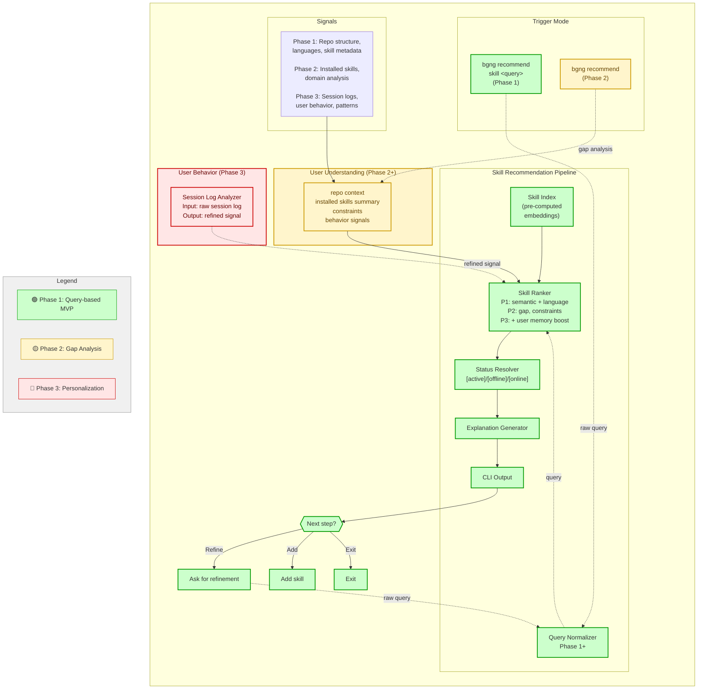

# Skill Recommendation Feature PRD

**Version:** 0.3
**Last Updated:** 2026-05-08  
**Status:** Ready for Phase 1 Implementation

---

## Document Metadata

**Date Created:** 2026-05-04

**Last Updated:** 2026-05-08

**Author(s):** Junggyu Bae, Claude Code

**Version:** 0.3

**Changelog:**
- v0.3 (2026-05-08): Aligned prd.md ↔ prd_phase1_steps.md
- v0.2 (2026-05-07): Modified Session log features, focusing on “hard skills”
- v0.1 (2026-05-06): Adjusted pipeline and development phases
- v0.0 (2026-05-04): Initial PRD for Skill Recommendation Engine

---

## Overview

Add `bgng recommend` command with two modes:

1. **`bgng recommend skill <query>`** (Phase 1) — Ranked search. Find matching skills, rank by semantic relevance + repo context, explain why each matters.
2. **`bgng recommend`** (Phase 2) — Gap analysis. Analyze installed skills, detect missing domains, recommend complementary skills to round out the toolkit.

Both complement `bgng search` by adding intelligent ranking and explanations.

**Scope:** beginning-harness focuses on **general skill recommendation from existing npm skill pool** (hard skills: testing, security, performance, patterns, etc.). This differs from beginning-agents, which would focus on soft skills (collaboration, communication) requiring new skill taxonomy. Phase 1–2 recommend from npm skills; Phase 3 personalizes recommendations based on user adoption behavior.

---

## Problem

`bgng search skill` returns unranked results. With 500+ skills, users don't know which match their project. A TypeScript user searching "testing" sees identical results as a Python user—missing repo-aware ranking. No explanations either.

---

## Solution

Add `bgng recommend skill <query>` with three-factor ranking:
1. **Semantic similarity (60%)** — embed query + skill descriptions, find matches
2. **Popularity (30%)** — install counts, GitHub stars, freshness
3. **Language matching (10%)** — prioritize skills for detected project language

Each result includes a one-line explanation and availability status.

---

## Phase 1 Goals (MVP)

- Find all matching skills for a query
- Rank by semantic (60%) + popularity (30%) + language (10%)
- Show top-5 with explanations and status labels
- Interactive loop: refine query, add skill, or exit
- **Success bar:** >80% top-5 results relevant (manual eval on 20+ queries)
- **Latency:** <300ms p95 (full), <100ms (ranking-only from cache)

---

## Phase 2–3 (Future)

**Phase 2 (Mid):**

- Gap analyzer: detect missing domains in installed skills
- Skill Ranker enhanced: score by (gap relevance + semantic similarity + language + constraints)
- User Understanding: analyze repo + installed skills → context, constraints, behavior signals
- Both query-based and gap-based modes fully operational
- Status: `[active]` | `[available offline]` | `[available online]` with explanations
- Latency: TBD (after Phase 1 Mastra learnings)

**Phase 3 (Future):**

- Session log signals: capture accepts, ignores, refinements, skill adoptions per session
- Behavior interpretation: analyze patterns (what user searches, which skills they add, rejection reasons)
- Long-term user memory: build persistent profile of adoption patterns, preferences, constraints
- Advanced ranking: boost recommendations based on learned user profile + behavior history

---

## Architecture

**Core pipeline:** Query → Embed → Rank → Explain → Output

**Components:**
- **Skill Indexer** — Load all skills; pre-compute embeddings (Mastra AI, 512-dim)
- **Repo Detector** — Detect project language from file extensions
- **Query Ranker** — Score & rank by 3-factor formula; threshold ≥0.5 semantic
- **Explanation Generator** — Contextual reason per result (language + domain aware)
- **CLI Command** — `bgng recommend skill <query>` with menu-style interaction

**Data sources:**
- Skill metadata: Skills-API (installs, stars, domain, languages)
- Embeddings: Mastra AI (512-dim, 7-day cache)
- Backup: Local skills-registry.json (if API unavailable)

**Ranking formula:**
```
score = 0.6×semantic + 0.3×popularity + 0.1×language

semantic = cosine(query_embedding, skill_embedding), filtered ≥0.5
popularity = normalized(installs, stars, freshness)
language = 1.0 (primary), 0.7 (secondary), 0.0 (no match)
```

---

## System Architecture Pipeline



---

## Example Output

```
$ bgng recommend skill testing

[Detected: TypeScript (65%), Python (25%), Go (10%)]

Recommended skills:
1. /test-coverage [online]
   Matches "testing". Your TypeScript project would benefit from coverage analysis.
   Score: 0.89 | 14.2K installs | ⭐ 892

2. /tdd-workflow [offline]
   Matches "testing". Your TypeScript project would benefit from test-driven development.
   Score: 0.87 | 8.5K installs | ⭐ 421

3. /python-testing [online]
   Matches "testing" (less relevant for TypeScript). General testing patterns for Python.
   Score: 0.62 | 6.1K installs | ⭐ 312

What next?
  1. Add skill
  2. Refine search
  3. Exit

Your choice (1-3): 1
Adding /test-coverage...
✅ Skill added successfully

What next?
  1. Add skill
  2. Refine search
  3. Exit

Your choice (1-3): 2
New query: test-driven development
[Searching...]
...
```

---

## Acceptance Criteria

| Metric | Target |
|--------|--------|
| Relevance | >80% top-5 relevant (manual eval, 20+ queries) |
| Latency | <300ms p95 (full), <100ms (ranking-only) |
| Status accuracy | 95%+ correct labels |
| Coverage | 100% skill registry indexed |
| Regressions | None in existing `bgng` commands |

---

## Key Assumptions

- **Single language per project:** Detect primary language by file count; secondary languages get 0.7 boost in scoring
- **Semantic threshold:** ≥0.5 cosine similarity (not hard filter; language/popularity can rank low-semantic skills)
- **Caching:** Embeddings cached 7 days; skills-api polled every 24h
- **Skill domains:** testing, security, performance, deployment, documentation, patterns, code-quality, debugging, refactoring, internationalization

---

## Error Handling

| Scenario | Behavior |
|----------|----------|
| Embedding API fails | Skip popularity; use semantic+language only |
| No matches found | Suggest query refinement with common domains |
| Language undetectable | Use semantic-only ranking; inform user |
| Skill metadata malformed | Skip that skill; log warning |

---

## Implementation Details

See `prd_phase1_steps.md` for:
- 9 detailed implementation tasks (Skill Indexer, Repo Detector, Ranker, etc.)
- Pre-implementation blocking gates (Day 0–1 validation)
- Learning objectives & Phase 1b pivots
- 5-week timeline with dependencies
- Design alternatives & tradeoffs

---

## Phase 1 Non-Goals

- Gap-based recommendations (Phase 2)
- Personalization or user behavior learning (Phase 3)
- Changes to existing `bgng` commands
- Dashboard/UI — CLI output only
